  

# Delivra (Whatsapp scheduler for android)

**Schedule WhatsApp messages that send automatically - even when your phone is locked.**

Fully on-device. Pick a contact, pick a date & time, attach anything you like - Delivra wakes
up on schedule, delivers the message through your own WhatsApp account, and goes back to sleep.
No servers. No accounts. No cloud.

## Get Delivra

**For most phones** - Samsung / Xiaomi / OnePlus / Pixel / Redmi / Realme / Vivo / Oppo
*(every device sold since ~2017)*

   

**Only for older 32-bit-only phones** *(rarely needed)*

Both buttons always download the newest release automatically.

---

## 🔧 What's new in v1.2.0 — Critical stability fix

> **If you installed v1.1.x, please update.** v1.1.x had a bug where opening the app on Day 2 (after connecting and scheduling on Day 1) caused a crash within 1–2 seconds of launch, making the app completely unusable until reinstalled.

**Changes in v1.2.0:**
- **Fixed Day-2 crash** — the Node.js engine lifecycle was not properly reset between app sessions, causing a 30-second timeout + crash on every cold open after Day 1
- **Fixed session file safety** — WhatsApp session files are now written atomically (temp-file + rename), preventing session corruption if the app is killed mid-write
- **Removed unnecessary service auto-start** — the app no longer wakes the background engine on every launch (better battery, eliminates the crash trigger)

---

## What Delivra does

| | |
|---|---|
| **What** | Schedules WhatsApp messages (text, voice notes, images, PDFs/docs) and delivers them automatically at the exact moment you choose |
| **How** | Links to your WhatsApp as a *companion device* - same protocol as WhatsApp Web - and sends through your own account |
| **Where your data lives** | Entirely on your phone: schedules, session keys, attachments. No backend server, no analytics, no telemetry |
| **Battery philosophy** | Connect-on-demand: the app runs only ~2 minutes around each scheduled send. The rest of the time it does not exist |

---

## ✨ Feature Highlights

### 🗓️ Exact Date & Time Scheduling
Schedule messages precisely with timezone-safe date and time handling.

### 💬 Rich Message Support
Send text messages, real PTT voice notes, inline photos, PDFs, Word files, and other documents.

### 🌙 Screen-Off Delivery
Reliable scheduled delivery even when the screen is off, using exact alarms and a one-tap battery-optimization setup.

### 🔄 Smart Retry System
Automatic retries with backoff, failure notifications, and a **Needs Review** state to prevent silent duplicate sends.

### 👥 Contact Suggestions
Get contact suggestions directly from your phone book for faster message scheduling.

---

## Getting started

1. Tap **DOWNLOAD ARM64-V8A** above (green button only if your phone is ancient)
2. Open the downloaded file, allow **Install from unknown sources** if asked
3. Open Delivra, enter your WhatsApp number, receive an 8-character code
4. In WhatsApp: **Settings > Linked Devices > Link a Device > "Link with phone number instead"**, type the code
5. Flip the **Reliable delivery** toggle on the Home screen - this makes scheduled sends survive a locked screen

---

## Screenshots

| Message Screen                                                                       | Scheduled Message                                                                    | Home Screen                                                                       |
| ------------------------------------------------------------------------------------ | ------------------------------------------------------------------------------------ | ------------------------------------------------------------------------------------ |
|  |  |  |

## Permissions Explained

| Permission | Why |
|---|---|
| `INTERNET` | Speak the WhatsApp multi-device protocol |
| `SCHEDULE_EXACT_ALARM` / `USE_EXACT_ALARM` | Fire sends at the minute you picked |
| `REQUEST_IGNORE_BATTERY_OPTIMIZATIONS` | One-time ask to bypass Doze so locked-screen sends reach the network |
| `FOREGROUND_SERVICE` (`connectedDevice`) | Brief foreground session around each send, with a visible notification |
| `RECEIVE_BOOT_COMPLETED` | Restore schedules after reboot - nothing else |
| `WAKE_LOCK` | Hold the CPU for the few minutes a dispatch takes |
| `POST_NOTIFICATIONS` | Failure alerts + temporary sending notification |
| `READ_CONTACTS` | Contact name/photo suggestions while composing |
| `RECORD_AUDIO` | In-app voice-note recording |
| `READ_EXTERNAL_STORAGE` (Android 12 and below) | Legacy attachment read path |

---

## Architecture

- **Kotlin + Jetpack Compose** - UI, Room database, alarm/backstop scheduling, retry state machine
- **Embedded Node.js (nodejs-mobile)** - hosts the Baileys WhatsApp engine inside the app process, started only when there is something to send
- **Local TCP bridge** - correlation-id matched JSON channel between Kotlin and Node
- **Offline-first** - the only network traffic is with WhatsApp itself

---

> &nbsp;*Delivra is an independent productivity and scheduling utility for WhatsApp messaging. It is not affiliated with, endorsed by, or officially connected to WhatsApp or Meta.*
